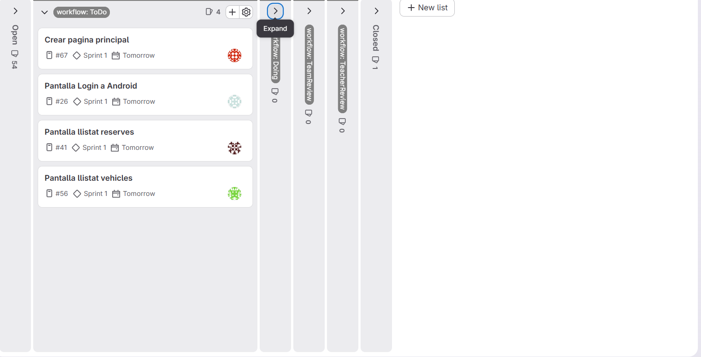
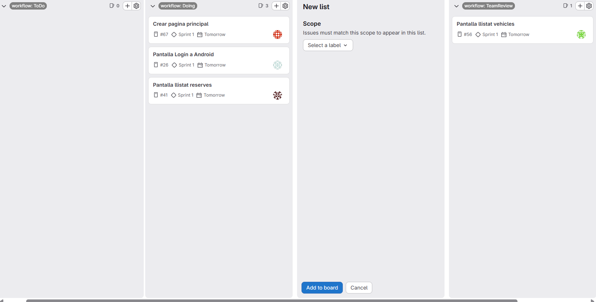
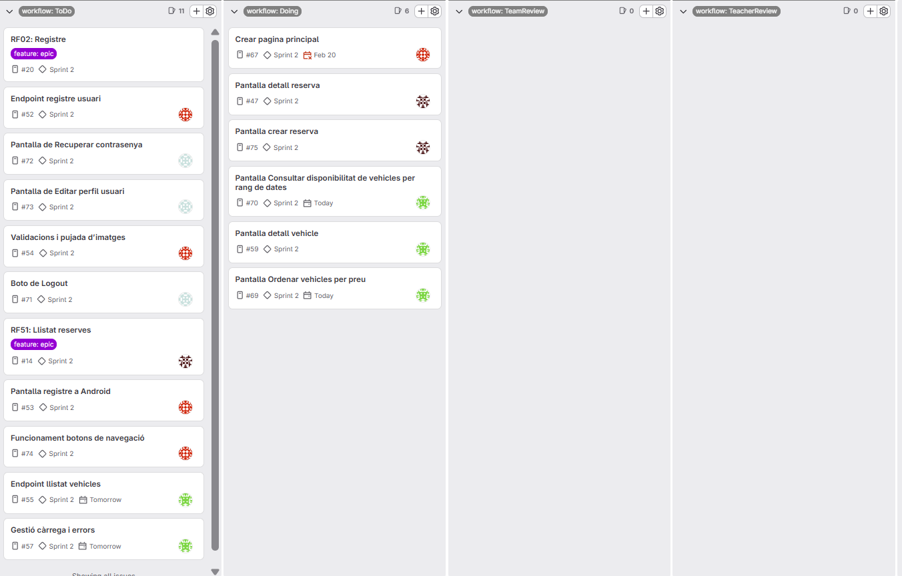
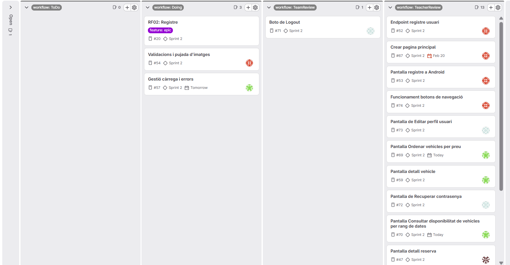
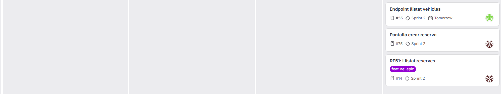
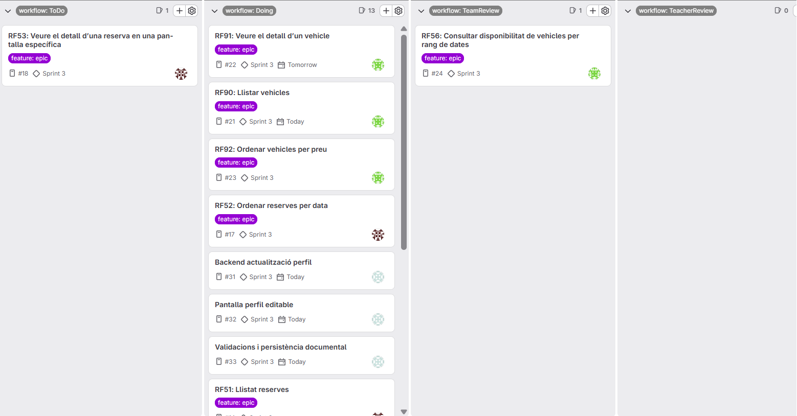
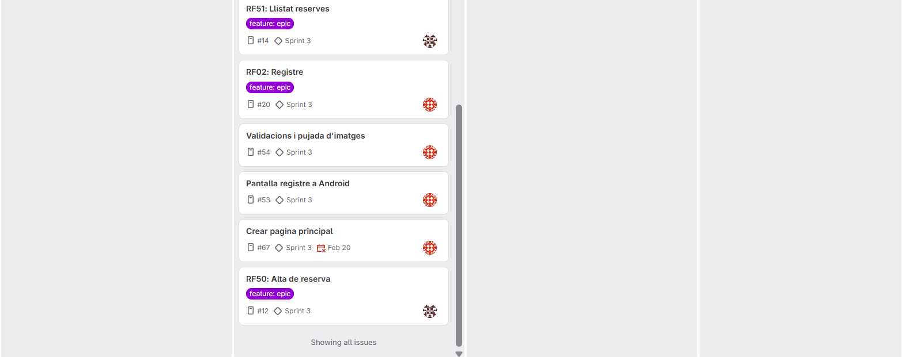
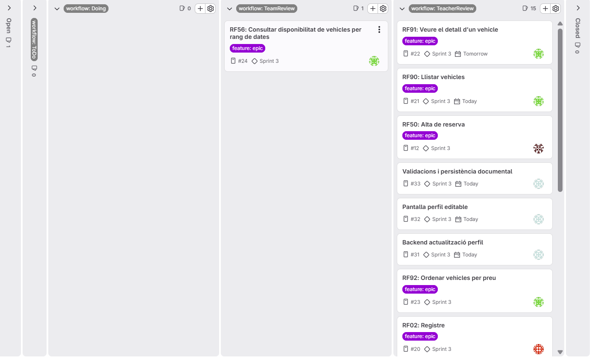
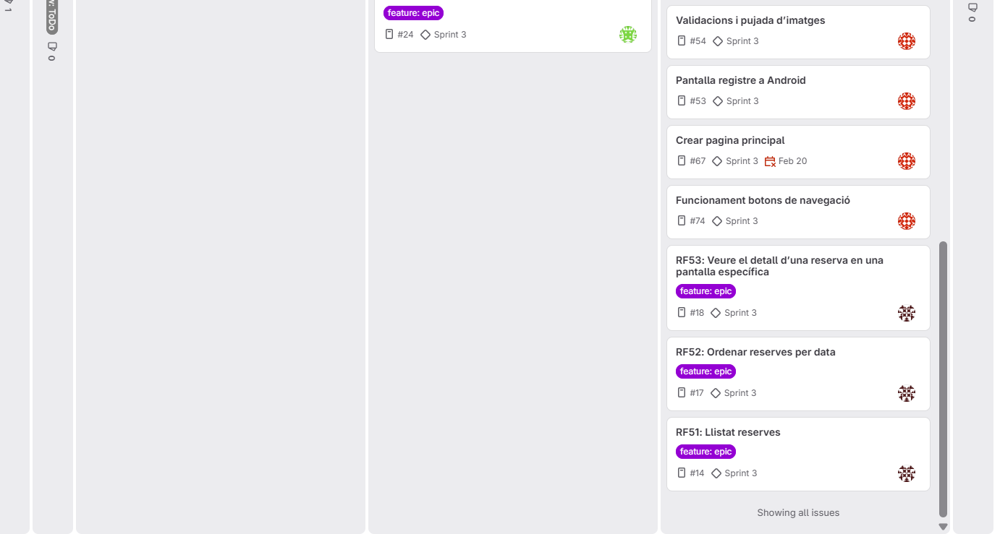

= DAILY STAND UP
:toc:
:toclevels: 2
:sectnums:

== SPRINT 1

=== Daily standup

==== 13/02/2026

[cols="1,3,3,3,1", options="header"]
|===
|Nom |QUE ES VA FER AHIR |QUE ES FARA AVUI |PREOCUPACIONS QUE ES TENEN |HORES TREBALLADES

|JAVIER
|És el primer dia de projecte
|Avui he faltat a classe
|La preocupació més gran seria les poques setmanes que queden per entregar el projecte
|3H

|HAMZA
|-
|Avui organitzarem i revisaré la gestió del codi amb GitLab i la seva estructura
|Em preocupa el temps que tenim per fer tot el
|3H

|BACHIR
|-
|He après a utilitzar les noves funcionalitats necessaries al gitlab i las he implementat
|La organització / estructura del projecte
|6H

|JOEL
|-
|Teoria i probar les noves eines del gitlab
|El nou entorn de desnvolupament, fer servir android studio i kotlin i tot aixo amb tant poc temps
|3h
|===

==== 18/02/2026

[cols="1,3,3,3,1", options="header"]
|===
|Nom |QUE ES VA FER AHIR |QUE ES FARA AVUI |PREOCUPACIONS QUE ES TENEN |HORES TREBALLADES

|JAVIER
|El passat divendres vaig faltar a classe
|Avui organitzarem tot, crearé el Daily Stand Up i també finalitzaré els epics dels requisits funcionals més els issues d’aquests
|Encara no tinc cap preocupació ja que estem començat, potser l’única preocupació és que només hagin 3 Sprints
|3H

|HAMZA
|-
|Avui organitzarem i revisaré la gestió del codi amb GitLab i la seva estructura
|-
|3H

|BACHIR
|Vaig implementar totes les funcionalitats al gitlab necessaries
|Crearé l'estructura del projecte al Android Studio tenint en compte l'enunciat
|No accabo d'entendre com fer l'estructura
|3H

|JOEL
|Teoria i probar coses de gitlab i organitzar una mica
|Organitzar amb el grup, asignarse tasques començar amb la primera pantalla i investigar i aprofondir al enunciat
|Les mateixes preocupacions, moltes coses noves i poc temps, no se per on començar
|3H
|===

==== 19/02/2026

[cols="1,3,3,3,1", options="header"]
|===
|Nom |QUE ES VA FER AHIR |QUE ES FARA AVUI |PREOCUPACIONS QUE ES TENEN |HORES TREBALLADES

|JAVIER
|Vaig fer el daily stand up i crear els epics
|He fet la pantalla de llistar vehicles
|Tinc la preocupació de que el Kotlin dona molts errors i el Android també
|4H

|HAMZA
|Vaig organitzar i revisar la gestió del codi al gitlab i la seva estructura
|He començat a fer les pantalles de reserva
|Tinc la preocupacio del temps
|4H

|BACHIR
|Vaig començar a fer l'estructura sense gaire èxit
|Acabré l'estructura i intentaré comprobar la connexió entra backend i frontend
|No he pogut avançar res de RF o codi, molts errors
|4H

|JOEL
|Vaig organitzar amb el grup, em vaig asignar tasques, començar amb la primera pantalla i investigar
i aprofondir al enunciat
|Em creare una branca i intentare veure que es el que no em funcionaba de la pantalla anterior (Intenar acabarla
de manera correcta si es posible), a més, fare probes amb el chat gpt per veure com podriem fer el
projecte correctament
|Que no entenc molt be alguns errors perque no controlo ni el entorn ni l'estructura ni el llenguatge
|5h
|===

=== Captures board

==== Board inicial

==== Board final

=== RETROSPECTIVE MEETING

[cols="1,3,3,3", options="header"]
|===
|Sprint |Aspectes positius |Aspectes a millorar |Accions concretes

|Sprint 1
|Un dels aspectes positius és que som 4 en el grup i per tant hi ha menys treball individual
|Comunicació i objectius clars +
Hem tingut problemes per entendre i començar el projecte
|Comunicar en cada cas el que estem fent i sobretot el que volem que faci un altra company del grup; i també afegir +
objectius clars i concrets (pantalles i requisits específics)
|===

---

== SPRINT 2

=== Daily standup

==== 20/02/2026

[cols="1,3,3,3,1", options="header"]
|===
|Nom |QUE ES VA FER AHIR |QUE ES FARA AVUI |PREOCUPACIONS QUE ES TENEN |HORES TREBALLADES

|JAVIER
|Ahir vam fer tota la documentació (Daily Stand Up ) i també vaig crear els epics amb els issues
|Avui he reestructurat tots els fitxers correctament i he començat a crear la pantalla de Vehicle
|Tinc preocupació de Kotlin ja que hi ha moltes coses i molts errors que tinc que no entenc
|5H

|HAMZA
|Ahir vaig acabar la pantalla
|Avui continuaré revisant l’error d’arrencada i avançaré amb el que pugui de les pantalles
|Em preocupa que el projecte no s’arrenqui correctament i això freni el progrés
|5H

|BACHIR
| -
|Avuí intentaré resoldre els errors de sincronització i gradle del projecte
|No aconsegueixo veure o solucionar l'error
|3H

|JOEL
|Vaig crear una branca i vaig veure que es el que no em funcionaba de la pantalla anterior (Intenar acabarla
de manera correcta si es posible), a més, vaig fer probes amb el chat gpt per veure com podriem fer el
projecte correctament
|Revisio del Sprint amb el Manel, parlar de dubtes i organitzar els issues i el tauler i crear tasques.
|Temps i que tot surti bé
|4h
|===

==== 23/02/2026

[cols="1,3,3,3,1", options="header"]
|===
|Nom |QUE ES VA FER AHIR |QUE ES FARA AVUI |PREOCUPACIONS QUE ES TENEN |HORES TREBALLADES

|JAVIER
|Ahir vaig fer tots els fitxers correctament i he començat a crear la pantalla de Vehicle
|Avui he creat les 4 pantalles de vehicle, però al final de la classe l'Esther m'ha indicat que he d'unificar 3 pantalles en 1 sola (llistar, ordenar i filtrar)
|La preocupació més gran es el temps i una mica d'incertesa en la construcció del backend
|5H

|HAMZA
|Ahir vaig començar la pantalla de llistar reserves
|Avui acabaré la pantalla de detall i de crear de reserva.
|Preocupació per l’organització correcta dels RF i com connectar les pantalles amb la lògica.
|4H

|BACHIR
|Ahir vaig acabar de arreglar problemes amb la sincronitzacio del projecte
|Avui he començat la pantallas principal i de registre, a més de dividir la pantalla de registre en 3 pantalles
|Hauria de fer el bottom navigation per poder veure pantalles
|6H

|JOEL
|Revisio del Sprint amb el Manel, parlar de dubtes i organitzar els issues i el tauler i crear tasques.
|Creare la pantalla de login i la de recuperar contrasenya, també si em dona temps començare la de edit profile i preguntare dubtes
|La manera de fer les pantalles funcionals i que no surgeixin problemes a l'hora d'utilitzar el android studio i sincroniztar cambis
|3H
|===

==== 24/02/2026

[cols="1,3,3,3,1", options="header"]
|===
|Nom |QUE ES VA FER AHIR |QUE ES FARA AVUI |PREOCUPACIONS QUE ES TENEN |HORES TREBALLADES

|JAVIER
|Ahir vaig crear les 4 pantalles de vehicle, però al final de la classe l'Esther m'ha indicat que he d'unificar 3 pantalles en 1 sola (llistar, ordenar i filtrar)
|Avui he començt a unificar les pantalles i a plantejar com unir-les.
|La preocupació més gran es quins son els pasos per començar correctament amb el backend però mica en mica vaig agafant informació
|1H

|HAMZA
|
|
|
|

|BACHIR
|
|
|
|

|JOEL
|
|
|
|
|===

==== 25/02/2026

[cols="1,3,3,3,1", options="header"]
|===
|Nom |QUE ES VA FER AHIR |QUE ES FARA AVUI |PREOCUPACIONS QUE ES TENEN |HORES TREBALLADES

|JAVIER
|Ahir vaig crear totes les pantalles de Vehicle però al final l'Esther em va indicar que l'habia d'unificar 3 en 1.
|Avui he finalitzat la unificació de les pantalles de llistar, odernar per preu i filtrar per dates en una sola pantalla (VehicleLlistarScreen)
|Preocupació per part de la creació dels RF
|2H

|HAMZA
|Ahir vaig acabar la pantalla de crear reserva i vaig revisar les tres pantalles .
|Avui començaré a implementar la lògica del RF de reserves .
|Preocupació per la implementació correcta dels RF i la connexió amb el backend.
|3H

|BACHIR
|Ahir vaig fer les pantalles de registre i la pantalla principal
|Avui faré el bottom navigation funcional i començaré a fer el RF de registre
|No sé com conectar les dades del backend al frontend
|3H

|JOEL
|Ahir vaig crear la pantalla de login i la de recuperar contrasenya, també vaig començar la de edit profile i vaig preguntar dubtes
|Avui acabare la pantalla de edit profile i començare el Rf de edit profile
|La manera de fer les pantalles funcionals i que no surgeixin problemes a l'hora d'utilitzar el android studio i sincroniztar cambis
|3H
|===

==== 26/02/2026

[cols="1,3,3,3,1", options="header"]
|===
|Nom |QUE ES VA FER AHIR |QUE ES FARA AVUI |PREOCUPACIONS QUE ES TENEN |HORES TREBALLADES

|JAVIER
|Ahir vaig unificar les pantalles de vehicle
|Avui he fet tot el backend de java (vehicle service, vehicle controller, vehicle i vehicle mapper)
|El temps que falta i que els seguents RF siguin mes complicats
|3H

|HAMZA
|Ahir vaig crear el ReservaController al backend i vaig començar a definir els endpoints necessaris per al RF de llistar reserves.
|Avui implementaré completament el RF de llistar reserves (Controller, Service i Repository) i començaré la connexió amb l'app perquè la pantalla ReserveListScreen funcioni amb dades reals.
|Preocupació per la correcta connexió entre backend i frontend.
|3H

|BACHIR
|Ahir vaig ver el bottom navigation i vaig començar amb el RF de registre
|Avui he acabat el RF de registre, nomes hem falta fer les validacions
|Encara ens falten molts RF i nomès queda un sprint
|3H

|JOEL
|Ahir vaig acabar la pantalla de edit profile i vaig començar el Rf de edit profile
|Avui intentare acabar el RF i cercare informació de com enllaçar les parts del projecte
|Saber conectar de manera correcta la part de android amb la de java i el temps.
|4H
|===

=== Captures board

==== Board inicial

==== Board final

=== RETROSPECTIVE MEETING

[cols="1,3,3,3", options="header"]
|===
|Sprint |Aspectes positius |Aspectes a millorar |Accions concretes

|Sprint 2
|Tots estem posant de la nostra part, no hi ha ningú que estigui endarrerit i la comunicació es bona
|Potser hem de ser mes eficients a l'hora d'acabar tasques, el temps s'acaba i ens hauria agradat poder haber avançat més
|Intentar preguntar mes dubtes per tenir més clara l'informació a l'hora de començar una tasca
|===

== SPRINT 3

=== Daily standup

==== 27/02/2026

[cols="1,3,3,3,1", options="header"]
|===
|Nom |QUE ES VA FER AHIR |QUE ES FARA AVUI |PREOCUPACIONS QUE ES TENEN |HORES TREBALLADES

|JAVIER
|Ahir vaig fer tot el backend de JAVA
|Avui he continuat amb el backend per deixar-ho llest i he començat a veure que hi ha problemes amb les meves funcionalitats al Android a les meves pantalles
|El que més em preocupa és quants RF arribaré a finalitzar en aquest srpint, espero que al menys 2
|5H/0H

|HAMZA
|Ahir vaig dedicar el temps a revisar i arreglar alguns errors que havien quedat del Sprint 2, sobretot problemes que afectaven algunes pantalles d’Android. També vaig començar a mirar la funcionalitat d’anul·lar reserva per veure com implementar-la.
|Avui continuaré treballant en la implementació de la funcionalitat d’anul·lar reserva i revisant la lògica que ha de seguir segons l’estat de la reserva.
|Em preocupa una mica el temps que tindrem durant aquest sprint per acabar totes les funcionalitats de reserves.
|5H

|BACHIR
| -
| Avui he començat a fer la extracció strings / traducció als 3 idiomes de la pantalla registre
| A l'hora de trduir strings de missatges d'errors era més complicat
|3H/0H

|JOEL
|intentar acabar el RF i cercar informació de com enllaçar les parts del projecte
|La correció del sprint i la planificació del seguent, a mes de continuar amb el rf i analitzar com poder solucionar els problemes i completar les tasques.
|Em preocupa el temps i que no donin problemes d'ultima hora.
|5h
|===

==== 02/03/2026

[cols="1,3,3,3,1", options="header"]
|===
|Nom |QUE ES VA FER AHIR |QUE ES FARA AVUI |PREOCUPACIONS QUE ES TENEN |HORES TREBALLADES

|JAVIER
|Ahir vaig acabar tot el relacionat amb backend (per ara) i vaig començar a veure per què em donava tants problemes les funcionalitats de les pantalles
|Avui he estat tota la estona intentant arreglar els problemes que em dona Android però no se el que li passa, crec que és més senzill del que crec
|Estic una mica saturat i vaig una mica lent amb els meus companys a nivell de RF finalitzats o qüasi per finalitzar
|5H/0H

|HAMZA
|Ahir vaig continuar treballant amb la funcionalitat d’anul·lar reserva i vaig avançar bastant en la seva implementació dins de l’app Android.
|Avui continuaré amb aquesta funcionalitat per deixar-la completament implementada i comprovar que funciona correctament amb el backend.
|Em preocupa que puguin aparèixer problemes d’integració amb el backend o errors que obliguin a tornar a revisar part del codi.
|5H

|BACHIR
| Ahir vaog fer la traducció de la pantalla de registre
| Avui intentaré fer totes les validacions de registre
| Dubtes amb algunes validacions com llicencia o DNI
|6H/0H

|JOEL
|La correció del sprint i la planificació del seguent, a mes de continuar amb el rf i analitzar com poder solucionar els problemes i completar les tasques.
|Seguir el RF perque me adonat de que no estaba fent-ho bé i donaba problemes
|Em preocupa el temps i que no donin problemes d'ultima hora.
|5h
|===

==== 04/03/2026

[cols="1,3,3,3,1", options="header"]
|===
|Nom |QUE ES VA FER AHIR |QUE ES FARA AVUI |PREOCUPACIONS QUE ES TENEN |HORES TREBALLADES

|JAVIER
|El dilluns vaig intentar arreglar els problemes d'Android sense cap èxit
|Avui he consigut arreglar el problema que habia al Android amb èxit tot i que estat tot el dia d'avui. Al final era una classe amb el mateix nom que altra (VehicleRepository) que estava amagada i donava error per això. També he pogut fer el RF de ordenar per preu al final de la classe
|Temps per acabar RF tot i que crec avui m'e pogut carregar un al menys
|5H/0H

|HAMZA
|Ahir vaig continuar treballant en la funcionalitat d’anul·lar reserva i fent proves per assegurar que funcionava correctament.
|Avui he començat a implementar la funcionalitat d’alta de reserva dins de l’app Android, preparant les pantalles i la lògica necessària.
|Em preocupa una mica que la connexió amb el backend pugui donar problemes quan comencem a integrar totes les funcionalitats.
|5H

|BACHIR
| El dilluns vaig acabar pràcticament amb totes les validacions de registre
| Avui he pogut resoldre els dubtes que tenia sobre les validacions i acabarles
| -
|3H/1H

|JOEL
|Practicament reinitciar o fer camvis a la manera de fer el rf perque ho estaba fent malament
|Posarme a tope per poder acabar el rf per aquest sprint
|Em preocupa el temps i que no donin problemes d'ultima hora.
|2h
|===

==== 05/03/2026

[cols="1,3,3,3,1", options="header"]
|===
|Nom |QUE ES VA FER AHIR |QUE ES FARA AVUI |PREOCUPACIONS QUE ES TENEN |HORES TREBALLADES

|JAVIER
|Ahir vaig arreglar el problema de Android i vaig finalitzar el RF d'ordenacio per preu de Vehicles
|Avui he conseguit fer 3 RF més ja que un cop arreglada el problema a Android la funcionalitat ja estava aplicada. Funcionan bé Veure el detall d'un vehicle (RF 91) i també Llistar Vehicles (RF90) i consultar disponibilitat de vehicles per rang de dates esta però no acaba de funcionar del tot bé (RF56)
|Menys preocupació ja que he pogut finalitzar 3 amb èxit i l'alrte l'acabaré aviat
|5H/0H

|HAMZA
|Ahir vaig continuar treballant en la funcionalitat d’alta de reserva i finalment he pogut acabar la seva implementació dins de l’app Android.
|Avui revisaré que totes les funcionalitats de reserves funcionin correctament i miraré de solucionar alguns petits errors que han aparegut després dels merges entre branques.
|Em preocupa una mica els conflictes que poden aparèixer amb els merges entre branques i que això pugui provocar errors al projecte.
|5H

|BACHIR
| Ahir vaig acabar de fer les validacions per registre
| Avui faré que es puguin pujar, veure i eliminar fotos a l'hora de fer el regsitre i milloraré visualment les pantalles
| A l'hora de pujar una foto en registre, no se com es fa per a que aquesta foto pugui ser accedida desde editar perfil
|4H/2H

|JOEL
|Treballar i deixar prop d'acabar el rf04
|Avui acabare el rf04 i modificare i també acabare del tot totes les pantalles fetas al sprint passat per aixi aconseguir el demanat per els profes i assolir les tasques, a mes fare merge i resolució de conflictes que sortiran al fusionar les branques.
|Em preocupa el temps i que no donin problemes d'ultima hora.
|5h
|===

=== Captures board

==== Board inicial

==== Board final

=== RETROSPECTIVE MEETING

[cols="1,3,3,3", options="header"]
|===
|Sprint |Aspectes positius |Aspectes a millorar |Accions concretes

|Sprint 3
|Bona comunicació, gran implicació i activitat dins i fora de l'escola.
|Tot i que pensavem que no finalitzariem molts RF al final hem finalitzat totalment 7 RF i 1 esta mig acabat. Quedarien 4 RF complets per fer
|Que la setmana que be tots nosaltres treballem a tope
|===